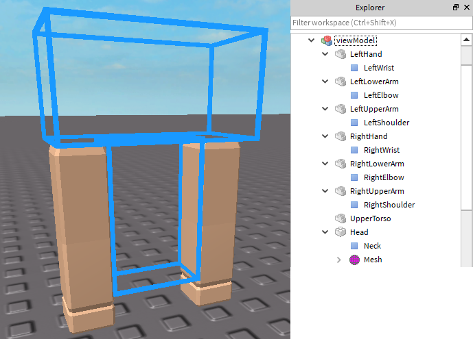
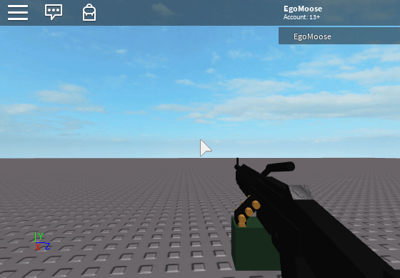
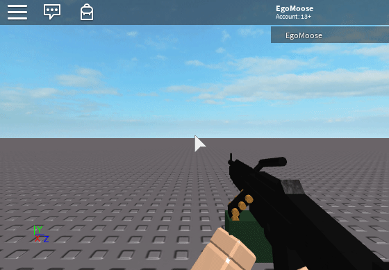
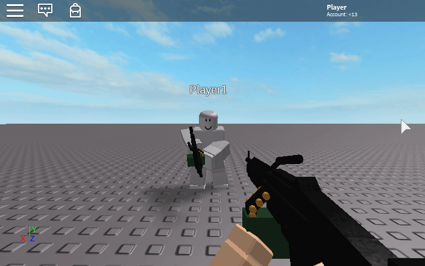
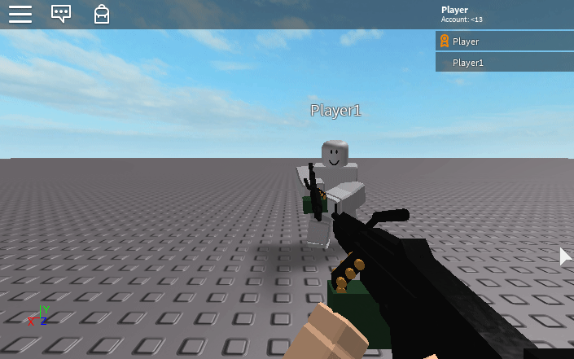

# The First Person Element Of A First Person Shooter

This post was originally written for [scriptinghelpers.org](https://scriptinghelpers.org/blog/the-first-person-element-of-a-first-person-shooter).

In this post we will be talking about creating our very own filtering enabled friendly first person shooter (FPS) game. I do want to make clear though that I won't be covering how to actually make the weapon shoot in this article. All we are going to be covering is the visuals meaning having the character aim down sights, look up and down, etc. Maybe we'll talk about shooting another day.

## Table of Contents

* [Things to take note of](#things-to-take-note-of)
* [Client](#client)
	* [Setting up the view model](#setting-up-the-view-model)
	* [Attaching the view model to the camera](#attaching-the-view-model-to-the-camera)
	* [Attaching the weapon to the view model](#attaching-the-weapon-to-the-view-model)
	* [Aiming down sights](#aiming-down-sights)
	* [Arm placement](#arm-placement)
* [Server](#server)
	* [Replicating weapon movement](#replicating-weapon-movement)
* [Edit: A slight ammendment](#edit-a-slight-ammendment)
* [Conclusion](#conclusion)

## Things to take note of

FPSs can get messy. Our goal of course is to keep things as straightforward as possible, but that can be difficult when we're dealing with the client server model. This is especially true for FPS games because in order to keep bandwidth low and games lag free a lot of tricks are used to trick the player. We'll talk about what some of those tricks are later on, but to make things simple we'll start off by focusing purely on the client and then we'll move to the server.

## Client

The only thing I'm going into this with is a simple weapon I had a friend make me. You should take note of a few small invisible parts that I've put in the model. The part `Handle` will be used to offset the weapon from our view and the parts `Right` and `Left` will be used to mark hand placement later. These parts all have their front face facing forward and their up face facing up. This helps ensure later on that we won’t have our weapon rotated in some odd way.


### Setting up the view model

When a player is fully zoomed into first person mode any `BaseParts` in their character model are invisible to them. This includes their arms, head, any non-tools, etc. To get around this we will create a view model that includes arms and a weapon. This view model will not actually be attached to the character, but rather to the camera. 

I created the viewmodel by adjusting the scale properties of my character for skinnier arms, creating a copy of it, and then removing everything inside except for the arms, the upper torso, and the head (and the connecting joints). I then made sure that the parts were all set to smooth plastic and the head and upper torso had their transparency set to `1`.



### Attaching the view model to the camera

Now that we have our view model we need to attach it to the camera. This is relatively simple because in first person the head and camera have the same CFrame. Thus, all we need to do is write an update loop that places our view model's head right where the camera is. We'll also be sure to remove the view model when the player dies.

```Lua
local camera = game.Workspace.CurrentCamera;
local humanoid = game.Players.LocalPlayer.CharacterAdded:Wait():WaitForChild("Humanoid");

local viewModel = game.ReplicatedStorage:WaitForChild("viewModel"):Clone();

local function onDied()
	viewModel.Parent = nil;
end

local function onUpdate(dt)
	viewModel.Head.CFrame = camera.CFrame;
end

humanoid.Died:Connect(onDied);
game:GetService("RunService").RenderStepped:Connect(onUpdate);
```

### Attaching the weapon to the view model

We can also take this opportunity to use a joint to attach the weapon to the viewl model's head which will ensure it stays relative to the camera as we rotate. You will have to play around with the `C0` value to properly offset the weapon. You will likely have to do this for every unique weapon you use due to varying sizes and what looks best in relation to your camera.

```Lua
local repWeapon = game.ReplicatedStorage:WaitForChild("M249");
local weapon = repWeapon:Clone();

weapon.Parent = viewModel;
viewModel.Parent = camera;

local joint = Instance.new("Motor6D");
joint.C0 = CFrame.new(1, -1.5, -2); -- what I found fit best
joint.Part0 = viewModel.Head;
joint.Part1 = weapon.Handle;
joint.Parent = viewModel.Head;
```


### Aiming down sights

To get our weapon to aim down the sights we will add a small invisible part to our weapon called `Aim`. We will use this part as a reference to where the weapon should be attached to the head when the player is aiming. Again, we’ll make sure the front face is facing forward and the up face is facing up.


Since we adjusted the `C0` value earlier we will make this adjustment in it's entirety with `C1` to avoid overlap.

To start we use the basic equality of joints we can figure out how to pick `C1` given that `weapon.Handle = joint.Part1` and we're setting `joint.Part1.CFrame = camera.CFrame`.

```
joint.Part0.CFrame * joint.C0 == joint.Part1.CFrame * joint.C1
joint.C1 = joint.Part1.CFrame:inverse() * joint.Part0.CFrame * joint.C0
-- recall though that joint.Part0.CFrame == camera.CFrame, thus:
joint.C1 = joint.C0
```

Of course we want to further adjust this so the camera focuses on the `Aim` part, not `Handle`. So using inverses we can find the offset that would be needed to move from the `Handle.CFrame` to the `Aim.CFrame`.

```
Handle.CFrame * offset = Aim.CFrame
offset = Handle.CFrame:inverse() * Aim.CFrame;
```

Putting this all together we get:

```Lua
local aimCount = 0;
local offset = weapon.Handle.CFrame:inverse() * weapon.Aim.CFrame;

local function aimDownSights(aiming)
	local start = joint.C1;
	local goal = aiming and joint.C0 * offset or CFrame.new();
	
	aimCount = aimCount + 1;
	local current = aimCount;
	for t = 0, 101, 10 do
		if (current ~= aimCount) then break; end
		game:GetService("RunService").RenderStepped:Wait();
		joint.C1 = start:Lerp(goal, t/100);
	end
end

local function onInputBegan(input, process)
	if (process) then return; end
	if (input.UserInputType == Enum.UserInputType.MouseButton2) then
		aimDownSights(true);
	end
end

local function onInputEnded(input, process)
	if (process) then return; end
	if (input.UserInputType == Enum.UserInputType.MouseButton2) then
		aimDownSights(false);
	end
end

game:GetService("UserInputService").InputBegan:Connect(onInputBegan);
game:GetService("UserInputService").InputEnded:Connect(onInputEnded);
```



### Arm placement

Now that we have the weapon in place we need to attach the arms to it by using the shoulder and elbow joints. We could manually figure out these values, but to keep things interesting and hassle free for other weapons we will use the `Right` and `Left` parts to calculate a `C1` for our shoulder joints.

```Lua
local function updateArm(key)
	-- get shoulder we are rotating
	local shoulder = viewModel[key.."UpperArm"][key.."Shoulder"];
	-- calculate worldspace arm cframe from Right or Left part in the weapon model
	local cf = weapon[key].CFrame * CFrame.Angles(math.pi/2, 0, 0) * CFrame.new(0, 1.5, 0);
	-- update the C1 value needed to for the arm to be at cf (do this by rearranging the joint equality from before)
	shoulder.C1 = cf:inverse() * shoulder.Part0.CFrame * shoulder.C0;
end

local function onUpdate(dt)
	viewModel.Head.CFrame = camera.CFrame;
	-- update every frame so the arms stay in place when the player aims down sights
	updateArm("Right");
	updateArm("Left");
end
```



## Server

So that takes care of the purely client side of things, from here on out everything we are dealing with is either going to be purely on the server, or a mix of the server and client.

### Replicating weapon movement

So far things look good from the player perspective, but if we run a quick multiplayer game we'll notice that none of the hard work we just did is visible to the other players!


Here's where one of those tricks I talked about earlier is going to come into play. Since we can't see our actual character in first person mode we're going to use it to replicate all our gun movements. This is pretty handy because what we replicate will have a slight delay from any player input and because we can't see it nobody will be any the wiser.

The first thing we will want to replicate is the player looking up and down. We'll do this by finding out the vertical angle the player's looking at, sending it to the server, and having the server rotate the `waist` and `neck` joints by half the angle to spread out the rotation.

```Lua
-- in server script
local remoteEvents = game.ReplicatedStorage:WaitForChild("RemoteEvents");

local neckC0 = CFrame.new(0, 0.8, 0, 1, 0, 0, 0, 1, 0, 0, 0, 1);
local waistC0 = CFrame.new(0, 0.2, 0, 1, 0, 0, 0, 1, 0, 0, 0, 1);

remoteEvents.tiltAt.OnServerEvent:Connect(function(player, theta)
	local neck = player.Character.Head.Neck;
	local waist = player.Character.UpperTorso.Waist;
	
	neck.C0 = neckC0 * CFrame.fromEulerAnglesYXZ(theta*0.5, 0, 0);
	waist.C0 = waistC0 * CFrame.fromEulerAnglesYXZ(theta*0.5, 0, 0);
end)

-- back in the client script
local remoteEvents = game.ReplicatedStorage:WaitForChild("RemoteEvents");

local function onUpdate(dt)
	viewModel.Head.CFrame = camera.CFrame;
	updateArm("Right");
	updateArm("Left");
	remoteEvents.tiltAt:FireServer(math.asin(camera.CFrame.LookVector.y));
end
```


That's looking a bit better! 

In order to get the character to hold the weapon we'll use a `Motor6D` to connect the `Handle` to the `RightHand`.

```Lua
-- in server script
remoteEvents.setup.OnServerEvent:Connect(function(player, weapon)
	local weapon = weapon:Clone();
	local joint = Instance.new("Motor6D")
	joint.Part0 = player.Character.RightHand;
	joint.Part1 = weapon.Handle;
	joint.Parent = weapon.Handle;
	weapon.Parent = player.Character;
end)

-- back in the client script
remoteEvents.setup:FireServer(repWeapon);
```

This will allow us to create an animation for when the player is just holding the weapon, and an animation when they player is aiming the weapon.


Using animations for this purpose is nice for two reasons. The first is that animations will automatically replicate, thus we don't need to worry about a `RemoteEvent`. The second is that by default animations will interpolate between each other which means we don't have to worry about smooth transitions.

```Lua
-- client
wait();
local holdAnim = humanoid:LoadAnimation(repWeapon.HoldAnim);
local aimAnim = humanoid:LoadAnimation(repWeapon.AimAnim);
local lastAnim = holdAnim;
lastAnim:Play();

local function aimDownSights(aiming)
	local start = joint.C1;
	local goal = aiming and joint.C0 * offset or CFrame.new();
	
	lastAnim:Stop();
	lastAnim = aiming and aimAnim or holdAnim;
	lastAnim:Play();
	
	aimCount = aimCount + 1;
	local current = aimCount;
	for t = 0, 101, 10 do
		if (current ~= aimCount) then break; end
		game:GetService("RunService").RenderStepped:Wait();
		joint.C1 = start:Lerp(goal, t/100);
	end
end
```

The one downside to animations is that Roblox doesn't like users sharing them. As a result you'll notice that if you load up the place I linked at the end of the post that the animations won't load. As a result if you are going to use my exact animations then I've saved them in a dummy for use with the animation editor. You'll have to load them in and export them to your own profile. If you do that remember to change the animation IDs.

The last thing we need to do is tilt the arms. Earlier we only applied the half the vertical tilt to the upper torso which is carried over to the arms, but we want the full rotation in the arms. This is easy enough to add if we just adust the `tiltAt` remove event.

```Lua
local neckC0 = CFrame.new(0, 0.8, 0, 1, 0, 0, 0, 1, 0, 0, 0, 1);
local waistC0 = CFrame.new(0, 0.2, 0, 1, 0, 0, 0, 1, 0, 0, 0, 1);
local rShoulderC0 = CFrame.new(1, 0.5, 0, 1, 0, 0, 0, 1, 0, 0, 0, 1);
local lShoulderC0 = CFrame.new(-1, 0.5, 0, 1, 0, 0, 0, 1, 0, 0, 0, 1);

remoteEvents.tiltAt.OnServerEvent:Connect(function(player, theta)
	local neck = player.Character.Head.Neck;
	local waist = player.Character.UpperTorso.Waist;
	local rShoulder = player.Character.RightUpperArm.RightShoulder;
	local lShoulder = player.Character.LeftUpperArm.LeftShoulder;
	
	neck.C0 = neckC0 * CFrame.fromEulerAnglesYXZ(theta*0.5, 0, 0);
	waist.C0 = waistC0 * CFrame.fromEulerAnglesYXZ(theta*0.5, 0, 0);
	rShoulder.C0 = rShoulderC0 * CFrame.fromEulerAnglesYXZ(theta*0.5, 0, 0);
	lShoulder.C0 = lShoulderC0 * CFrame.fromEulerAnglesYXZ(theta*0.5, 0, 0);
end)
```



## Edit: A slight ammendment

I had a user leave the following comment on the scripting helpers blog post:

>Wouldn't sending server updates every render step end up using a decent amount of traffic (on the server and on the client) esp. on big servers?

This is correct and was an oversight on my part when writing this post so i'll quickly cover that now in this section.

The trick to solving this problem is to use something on the server to constantly interpolate some target angle. This way we can send an updated angle every say 1/10th of a second and have the character smoothly look up and down as opposed to suddenly tilting when the server remote event is fired. 

There are two objects that are built into Roblox that will do this job for us. 

One is a `motor6D` where we can set the `Desired` when we fire the remote event and then use the `CurrentAngle` to actually update.

```Lua
-- server
remoteEvents.tiltAt.OnServerEvent:Connect(function(player, theta)	
	local tJoint = player.Character.Head:FindFirstChild("tiltJoint");
	if (tJoint) then
		tJoint.DesiredAngle = theta;
	end
end)

remoteEvents.setup.OnServerEvent:Connect(function(player, weapon)
	-- stuff from before...
	local tiltPart = Instance.new("Part");
	tiltPart.Size = Vector3.new(.1, .1, .1);
	tiltPart.Transparency = 1;
	tiltPart.CanCollide = false;
	tiltPart.Name = "tiltPart";
	tiltPart.Parent = player.Character;
	
	-- could adjust the maxVelocity
	local tJoint = Instance.new("Motor6D");
	tJoint.Name = "tiltJoint"
	tJoint.MaxVelocity = math.pi*2*0.01;
	tJoint.Part0 = player.Character.Head;
	tJoint.Part1 = tiltPart;
	tJoint.Parent = player.Character.Head;
	
	local neck = player.Character.Head.Neck;
	local waist = player.Character.UpperTorso.Waist;
	local rShoulder = player.Character.RightUpperArm.RightShoulder;
	local lShoulder = player.Character.LeftUpperArm.LeftShoulder;
	
	-- the updating happens on the server
	game:GetService("RunService").Heartbeat:Connect(function(dt)
		local theta = tJoint.CurrentAngle
		neck.C0 = neckC0 * CFrame.fromEulerAnglesYXZ(theta*0.5, 0, 0);
		waist.C0 = waistC0 * CFrame.fromEulerAnglesYXZ(theta*0.5, 0, 0);
		rShoulder.C0 = rShoulderC0 * CFrame.fromEulerAnglesYXZ(theta*0.5, 0, 0);
		lShoulder.C0 = lShoulderC0 * CFrame.fromEulerAnglesYXZ(theta*0.5, 0, 0);
	end)
end)

-- client (instead of firing in the onUpdate function we just put this at the end)
while (true) do
	wait(0.1);
	remoteEvents.tiltAt:FireServer(math.asin(camera.CFrame.LookVector.y));
end
```

The other is `BodyPosition`. We can set `BodyPosition.Position = Vector3.new(theta, 0, 0)` and then use the `Position` of the part it's a child of to find the interpolated angle.

```
remoteEvents.tiltAt.OnServerEvent:Connect(function(player, theta)	
	local tPart = player.Character:FindFirstChild("tiltPart");
	if (tPart) then
		tPart.BodyPosition.Position = Vector3.new(theta, 0, 0);
	end
end)

remoteEvents.setup.OnServerEvent:Connect(function(player, weapon)
	-- stuff from before...
	local tiltPart = Instance.new("Part");
	tiltPart.Size = Vector3.new(.1, .1, .1);
	tiltPart.Transparency = 1;
	tiltPart.CanCollide = false;
	tiltPart.Name = "tiltPart";
	tiltPart.Parent = player.Character;
	
	-- you could adjust the D, P, and maxForce values
	local bodyPos = Instance.new("BodyPosition");
	bodyPos.Parent = tiltPart;
	
	local neck = player.Character.Head.Neck;
	local waist = player.Character.UpperTorso.Waist;
	local rShoulder = player.Character.RightUpperArm.RightShoulder;
	local lShoulder = player.Character.LeftUpperArm.LeftShoulder;
	
	-- the updating happens on the server
	game:GetService("RunService").Heartbeat:Connect(function(dt)
		local theta = tiltPart.Position.x;
		neck.C0 = neckC0 * CFrame.fromEulerAnglesYXZ(theta*0.5, 0, 0);
		waist.C0 = waistC0 * CFrame.fromEulerAnglesYXZ(theta*0.5, 0, 0);
		rShoulder.C0 = rShoulderC0 * CFrame.fromEulerAnglesYXZ(theta*0.5, 0, 0);
		lShoulder.C0 = lShoulderC0 * CFrame.fromEulerAnglesYXZ(theta*0.5, 0, 0);
	end)
end)

-- client (again, instead of firing in the onUpdate function we just put this at the end)
while (true) do
	wait(0.1);
	remoteEvents.tiltAt:FireServer(math.asin(camera.CFrame.LookVector.y));
end
```


Personally I like the `BodyPosition` method a bit more because it provides a smoother interpolation. I have updated the place file with this method for you convenience.

## Conclusion

That about sums up the basics of the first person element of an FPS system. Hopefully having read through this post you can start to see how you might add onto it. For your convince I made the place file I created while writing this post uncopylocked. You can find the place [here.](https://www.roblox.com/games/2176065940/simple-FPS)

Thanks for reading!
